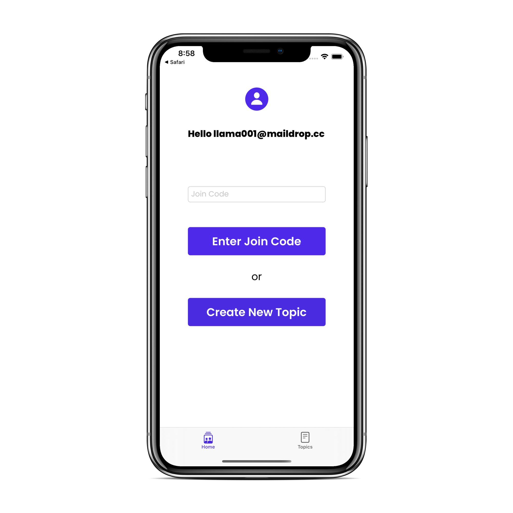
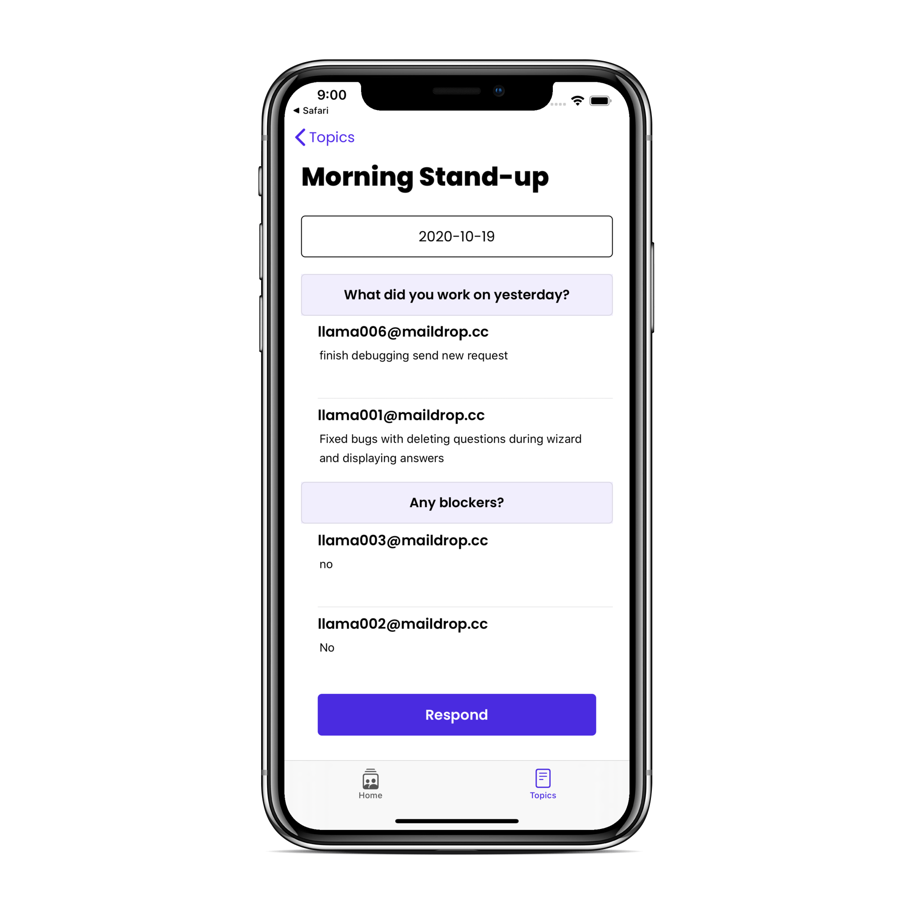
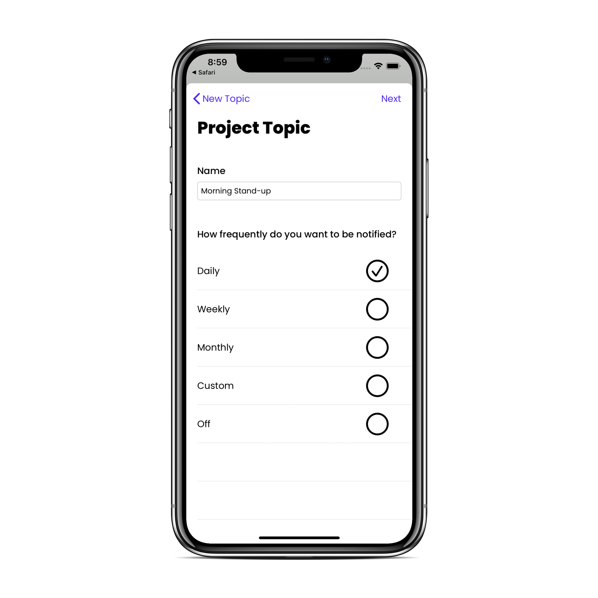
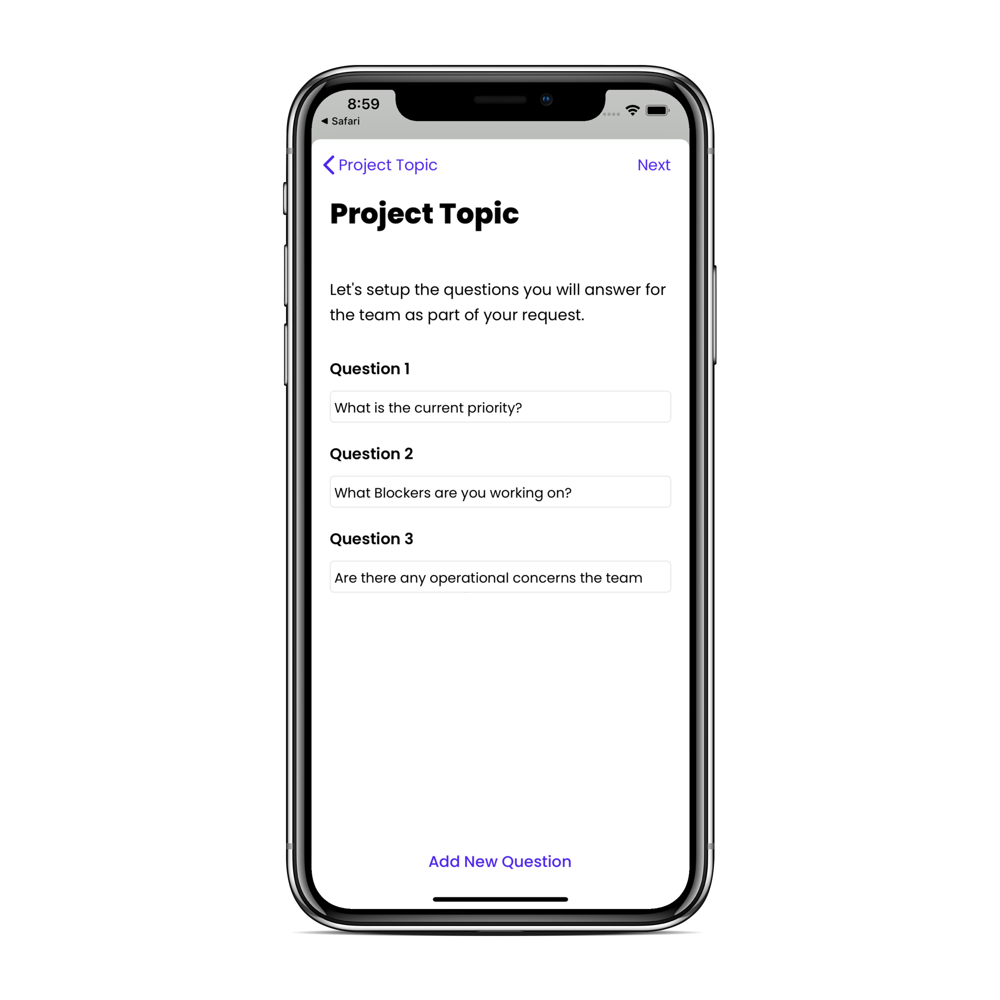
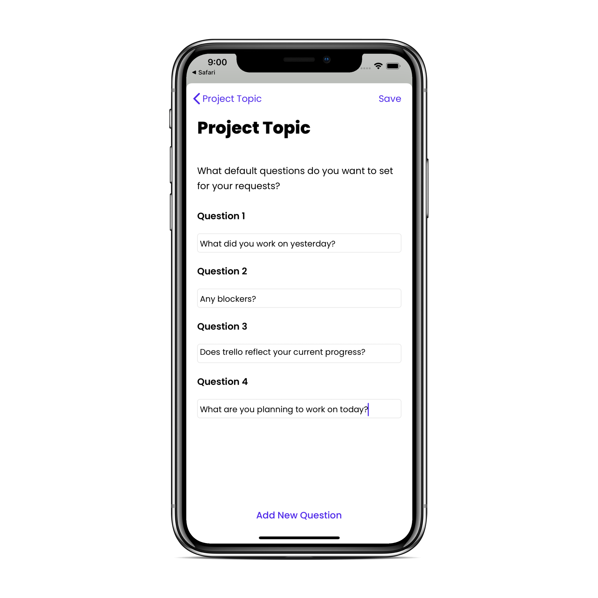
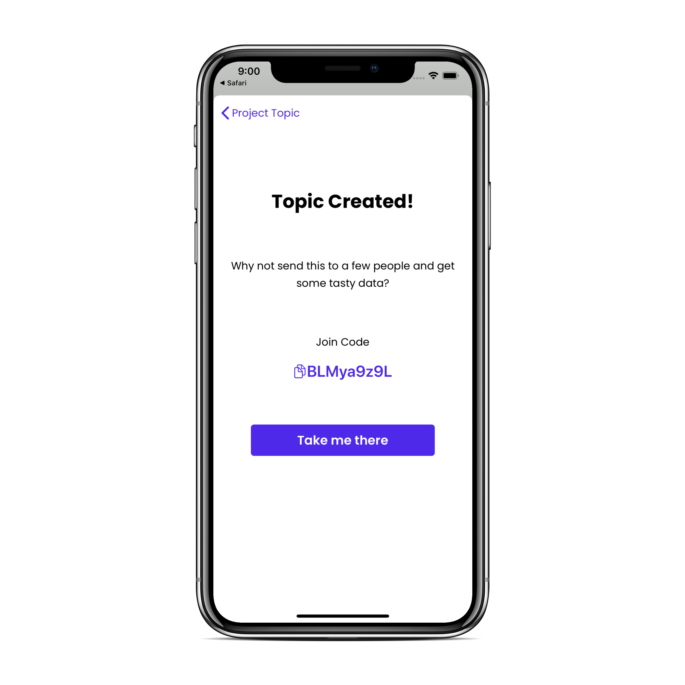

# Apollo

Apollo is an iOS app designed to provide another solution to daily standups.

### Project Overview

Apollo allows users to create and join topics. These topics contain surveys that are used in place of daily standups to simplify and speed up the process. The surveys contain questions that team members will respond to. However, they will be shown a list of questions that the topic creator has already answered, to give them more context on today's questions, before they respond.

### Key Features

- Create new topics
- Join existing topics
- Respond to surveys
- Create surveys in topics you created
- View a list of topics you have joined

## Dependencies

Thrid party framewoks and libraries are managed using Cocoapods.

### Pods used 
	- pod 'MessageKit'
  
## Screenshots

